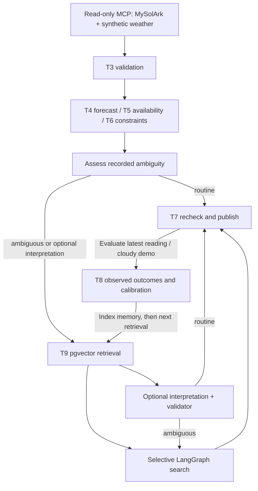

# Final MVP architecture

LangGraph owns the durable workflow; PostgreSQL owns canonical facts. The official
PostgreSQL checkpointer stores references and control state. LangChain `create_agent`
exists only inside interpretation, generator and critic nodes. Deep Agents is excluded.

All source access is read-only. T1/T2 expose exactly two MCP tools. T3 validates typed
source envelopes, UTC scrape freshness and the twelve-hour weather horizon. Deterministic
Python owns T4 forecasting, T5 power/energy math, T6 voltage/cap checks and T7 publication.
It rechecks freshness and constraints after model work. No hardware-control tools exist.

DW 1.24's fixed voltage floor is 305.2 V, mapped by the user to their approximate 30% reserve.
DW 1.21–1.25 each use a [fixed scanned floor](../../README.md#voltage-and-available-power).
No dynamic minimum can lower these floors. DW 1.24's observed range was 305.2–394.3 V. Measured SOC,
battery capacity, discharge energy and a voltage/SOC curve are not inferred.

Latest source selection uses wall time. The August 30–September 6 snapshot replay uses an
explicit Pacific-time selection for freshness at acquisition, calculation and publication.
Original scrape and actual save times are retained. Graph state, evidence and publication
preserve the wing/time selection. Replay uses generic guidance and cannot update live feedback;
live feedback stays with its wing. Fixed floors are retrospectively calibrated.

Start/Pause/Resume schedules historical steps sequentially in the foreground service process.
The `simulations` table stores the selected wing, bounded window, cadence and progress;
each step calls the existing LangGraph with a deterministic episode ID. Replay after an
interruption reuses that thread and its canonical publication. Pause finishes a step, while
server restart requires explicit Resume. No multi-worker queue is included. The UI polls
progress; Results opens fixed Inspector records while the simulator continues in the background.

The minimal forecast uses current PV power times synthetic hourly factors and constant
measured load. Available kW is nonnegative solar surplus, capped only when a cap is configured;
kWh integrates each interval. Battery-discharge budget is zero. No future voltage guarantee
or real equipment-capability claim is made. Live equipment cap remains unconfigured.

T8 compares newer point-power samples with forecasts; it does not claim measured hourly energy.
Raw outcomes, metrics and source/version-specific confidence summaries are separate records.
A demonstration solar-overestimation threshold of 0.25 kW triggers ambiguity. T9 stores
768-dimensional local embeddings in pgvector, retrieves five, filters/version-checks and
selects at most three. Cosine scores and critic rubric scores are not probabilities.

Selective search has three children per parent, beam two, one refinement and depth-three
submission. Hard pruning precedes critique; Python selects the surviving guidance or withholds.
All roles together may reserve at most eight attempts. Every attempt is stored before its
bounded, zero-tool model call and reused on resume. The optional third interpretation role is
controlled by `ENABLE_INTERPRETATION_AGENT=false`; A/B reuses one canonical source snapshot.
Free-text advice can still be wrong. Structured fields/citations do not prove semantic truth.

`AGENT_BACKEND=ollama|openai|anthropic` and `AGENT_MODEL` select the same provider/model for
all roles. Ollama remains the default; embeddings remain local. Cloud calls use native structured
output and the same local Pydantic validation, 45-second/768-token bound and zero retries.
API keys stay in local environment settings; audit rows record provider/model without credentials.
Cloud selection sends bounded model context to the selected API. Local audit persistence and
the deterministic graph authority are independent of provider choice.

The plain HTML/CSS/JS inspector exposes Context, Memory, Tools, Subagent, Trace and Health.
Audit records contain inputs, validated outputs, IDs, scores, prune reasons and limits,
never private chain-of-thought. Optional LangSmith receives only an allowlisted summary;
full local traces are independent of it. Its failure cannot change published decisions.

Native foreground scripts provide bootstrap/run/verify/demo. No Docker, secondary vector
store, daemon installation or production-control profile is included. Before operational
use, replace synthetic weather with a validated provider, establish actual equipment capability,
verify measurement-time semantics, and evaluate forecast/agent quality against held-out outcomes.
Real MySolArk integration is already present under the user's authorization; CAN formats,
provider credentials and site ratings were not invented.
