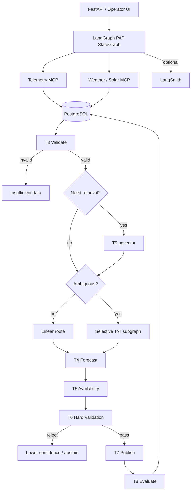

# PAP Runtime Architecture — v4

## Decision

- **LangGraph** — top-level stateful workflow harness.
- **LangChain `create_agent`** — selected model-driven nodes.
- **PostgreSQL** — relational system of record.
- **pgvector** — semantic RAG memory in PostgreSQL.
- **LangGraph PostgreSQL checkpointer** — durable workflow execution state.
- **MCP** — read-only Telemetry and Weather/Solar boundaries.
- **Deterministic Python** — validation, numerical work, constraints, budgets, hard pruning, publish/abstain authority.
- **LangSmith** — optional traces/evals.
- **Deep Agents** — intentionally excluded from PAP MVP.

## Persistence separation

### Domain tables
Canonical telemetry, weather, forecasts, PAPs, outcomes, calibration, provenance.

### pgvector semantic records
Approved semantic representations for RAG.

### LangGraph checkpoints
Execution snapshots for durable resume/HITL/debugging.

A checkpoint never replaces a canonical domain record.

## Agent nodes

Use LangChain agents only for:
- grounded interpretation;
- ToT candidate generation;
- qualitative critique;
- explanation.

They do not own arithmetic, constraints, permissions, or final safety.
